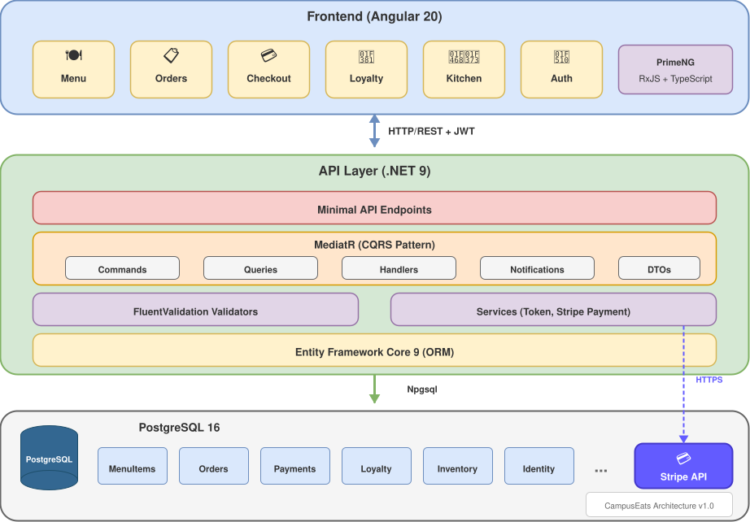

# 🍔 CampusEats

A full-stack campus food ordering and management platform built with **.NET 9** and **Angular 20**. Features a modern web application for students to browse menus, place orders, manage loyalty rewards, and make secure payments via Stripe.

[](https://dotnet.microsoft.com/)
[](https://angular.io/)
[](https://www.postgresql.org/)
[](https://stripe.com/)
[](LICENSE)

---

## 📋 Table of Contents

- [Features](#-features)
- [Architecture](#-architecture)
- [Tech Stack](#-tech-stack)
- [Prerequisites](#-prerequisites)
- [Getting Started](#-getting-started)
- [Project Structure](#-project-structure)
- [API Reference](#-api-reference)
- [Development](#-development)
- [Testing](#-testing)
- [Code Quality](#-code-quality)
- [Environment Variables](#-environment-variables)
- [Contributing](#-contributing)
- [License](#-license)

---

## ✨ Features

### Customer Features
- 🍽️ **Menu Browsing** - Browse categorized menu items with allergen and dietary restriction info
- 🛒 **Order Management** - Create, track, and view order history
- 💳 **Secure Payments** - Integrated Stripe payment processing
- 🎁 **Loyalty Program** - Earn and redeem loyalty points with tiered rewards
- 🔐 **User Authentication** - Secure JWT-based authentication

### Kitchen Features
- 👨‍🍳 **Kitchen Dashboard** - Real-time order queue for kitchen staff
- 📦 **Inventory Management** - Track and manage ingredient inventory
- ✅ **Order Fulfillment** - Update order status and complete orders

### Administrative Features
- 📊 **Menu Management** - Create, update, and delete menu items
- 🏷️ **Category Management** - Organize menu items by categories
- 📋 **Ingredient Tracking** - Manage menu item ingredients

---

## 🏗 Architecture

The application follows a **Clean Architecture** pattern with **CQRS** (Command Query Responsibility Segregation) using MediatR.

<p align="center">
  
</p>

> 📝 **Note:** The architecture diagram source file is available at [docs/architecture.drawio](docs/architecture.drawio). You can edit it using [draw.io](https://app.diagrams.net/) or the VS Code Draw.io extension.

### Key Architectural Decisions

| Layer | Technology | Pattern |
|-------|------------|---------|
| **Presentation** | Angular 20 + PrimeNG | Component-based, Lazy Loading |
| **API** | .NET 9 Minimal APIs | Vertical Slice Architecture |
| **Application** | MediatR | CQRS (Commands/Queries) |
| **Validation** | FluentValidation | Request Validation Pipeline |
| **Data Access** | EF Core 9 | Repository Pattern, Unit of Work |
| **Database** | PostgreSQL 16 | Relational with Migrations |
| **Auth** | ASP.NET Identity + JWT | Token-based Authentication |
| **Payments** | Stripe | Payment Intents API |

---

## 🛠 Tech Stack

### Backend
| Technology | Version | Purpose |
|------------|---------|---------|
| .NET | 9.0 | Web API Framework |
| Entity Framework Core | 9.0.10 | ORM & Database Migrations |
| PostgreSQL | 16+ | Primary Database |
| ASP.NET Identity | 9.0.10 | Authentication & Authorization |
| MediatR | 13.1.0 | CQRS & Mediator Pattern |
| FluentValidation | 12.0.0 | Request Validation |
| Stripe.net | 50.1.0 | Payment Processing |
| Swashbuckle | 9.0.6 | OpenAPI/Swagger Documentation |


### Frontend
| Technology | Version | Purpose |
|------------|---------|---------|
| Angular | 20.3.0 | SPA Framework |
| PrimeNG | 20.3.0 | UI Component Library |
| RxJS | 7.8.0 | Reactive Programming |
| Stripe.js | 8.6.1 | Payment Integration |
| TypeScript | 5.9.2 | Type-safe JavaScript |
| SCSS | - | Styling |

### Testing
| Technology | Version | Purpose |
|------------|---------|---------|
| xUnit | 2.9.3 | Test Framework |
| FluentAssertions | 7.0.0 | Assertion Library |
| NSubstitute | 5.3.0 | Mocking Framework |
| Moq | 4.20.72 | Mocking Framework |
| Coverlet | 6.0.2 | Code Coverage |
| Karma/Jasmine | - | Angular Unit Testing |

### DevOps & Quality
| Tool | Purpose |
|------|---------|
| SonarScanner | Code Quality Analysis |
| CSharpier | C# Code Formatting |
| Prettier | TypeScript/HTML Formatting |

---

## 📦 Prerequisites

Before you begin, ensure you have the following installed:

- [.NET 9 SDK](https://dotnet.microsoft.com/download/dotnet/9.0)
- [Node.js 20+](https://nodejs.org/) (LTS recommended)
- [PostgreSQL 16+](https://www.postgresql.org/download/)
- [Angular CLI](https://angular.io/cli) (`npm install -g @angular/cli`)
- [Git](https://git-scm.com/)
- [Stripe Account](https://stripe.com/) (for payment features)

---

## 🚀 Getting Started

### 1. Clone the Repository

```bash
git clone https://github.com/your-username/campus-eats.git
cd campus-eats
```

### 2. Database Setup

Create a PostgreSQL database:

```sql
CREATE DATABASE campuseats;
CREATE USER campuseats_user WITH PASSWORD 'your_password';
GRANT ALL PRIVILEGES ON DATABASE campuseats TO campuseats_user;
```

### 3. Environment Configuration

Create a `.env` file in the project root:

```env
# Database Configuration
DB_Host=localhost
DB_Port=5432
DB_Name=campuseats
DB_User=campuseats_user
DB_Password=your_password

# Stripe Configuration
STRIPE_SECRET_KEY=sk_test_your_secret_key
STRIPE_PUBLISHABLE_KEY=pk_test_your_publishable_key
STRIPE_WEBHOOK_SECRET=whsec_your_webhook_secret

# JWT Configuration (optional - configure in appsettings.json)
JWT_SECRET=your_super_secret_jwt_key_here
```

### 4. Backend Setup

```bash
# Restore .NET tools (CSharpier, SonarScanner)
dotnet tool restore

# Navigate to API project
cd src/CampusEats.Api

# Restore packages
dotnet restore

# Apply database migrations (auto-runs on startup, but can run manually)
dotnet ef database update

# Run the API (defaults to https://localhost:5001)
dotnet run
```

The API will automatically:
- Apply pending database migrations
- Seed initial data (loyalty rewards, allergens, categories, menu items)

### 5. Frontend Setup

```bash
# Navigate to web project
cd src/campus-eats-web

# Install dependencies
npm install

# Start development server (defaults to http://localhost:4200)
npm start
```

### 6. Access the Application

| Service | URL |
|---------|-----|
| Web Application | http://localhost:4200 |
| API | https://localhost:5001 |
| Swagger UI | https://localhost:5001/swagger |
| OpenAPI Spec | https://localhost:5001/openapi/v1.json |

---

## 📁 Project Structure

```
campus-eats/
├── src/
│   ├── CampusEats.Api/               # .NET Web API
│   │   ├── Common/                   # Shared services & interfaces
│   │   │   ├── Interfaces/           # Service interfaces
│   │   │   └── Services/             # Token, Payment services
│   │   ├── Data/                     # Data access layer
│   │   │   ├── Configurations/       # EF Core entity configurations
│   │   │   ├── Entities/             # Domain entities
│   │   │   ├── Extensions/           # Identity service extensions
│   │   │   └── Migrations/           # Database migrations
│   │   ├── Features/                 # Feature modules (Vertical Slices)
│   │   │   ├── Allergens/            # Allergen management
│   │   │   ├── DietaryRestrictions/  # Dietary restriction management
│   │   │   ├── Inventory/            # Inventory tracking
│   │   │   ├── LoyaltyPoints/        # Loyalty program
│   │   │   ├── Menu/                 # Menu & category management
│   │   │   ├── Orders/               # Order processing
│   │   │   ├── Payments/             # Stripe payment integration
│   │   │   └── Users/                # User management & auth
│   │   ├── Migrations/               # EF Core migrations
│   │   └── Program.cs                # Application entry point
│   │
│   └── campus-eats-web/              # Angular SPA
│       └── src/
│           └── app/
│               ├── core/             # Core services (auth, API)
│               ├── features/         # Feature modules
│               │   ├── auth/         # Login/Register
│               │   ├── checkout/     # Checkout process
│               │   ├── kitchen/      # Kitchen dashboard
│               │   ├── loyalty/      # Loyalty program UI
│               │   ├── menu/         # Menu browsing
│               │   └── orders/       # Order management
│               └── shared/           # Shared components & guards
│
├── tests/
│   └── CampusEats.Tests/             # Unit & integration tests
│       ├── Common/                   # Test utilities
│       ├── Data/                     # Data layer tests
│       └── Features/                 # Feature-specific tests
│
├── .env                              # Environment variables (gitignored)
├── CampusEats.sln                    # .NET solution file
├── dotnet-tools.json                 # .NET local tools config
└── README.md                         # This file
```

---

## 📡 API Reference

### Authentication Endpoints

| Method | Endpoint | Description | Auth Required |
|--------|----------|-------------|---------------|
| POST | `/api/users/register` | Register new user | ❌ |
| POST | `/api/users/login` | User login | ❌ |
| GET | `/api/users/me` | Get current user | ✅ |
| PUT | `/api/users/me` | Update current user | ✅ |
| DELETE | `/api/users/{id}` | Delete user | ✅ |

### Menu Endpoints

| Method | Endpoint | Description | Auth Required |
|--------|----------|-------------|---------------|
| GET | `/api/categories` | Get all categories | ❌ |
| GET | `/api/menuitems` | Get all menu items | ❌ |
| GET | `/api/menuitems/{id}` | Get menu item by ID | ❌ |
| POST | `/api/menuitems` | Create menu item | ✅ |
| PUT | `/api/menuitems/{id}` | Update menu item | ✅ |
| DELETE | `/api/menuitems/{id}` | Delete menu item | ✅ |

### Order Endpoints

| Method | Endpoint | Description | Auth Required |
|--------|----------|-------------|---------------|
| GET | `/api/orders/user/me` | Get user's orders | ✅ |
| GET | `/api/orders/pending` | Get pending orders (kitchen) | ✅ |
| POST | `/api/orders` | Create new order | ✅ |
| PUT | `/api/orders/{id}/status` | Update order status | ✅ |
| POST | `/api/orders/{id}/complete` | Complete order | ✅ |
| POST | `/api/orders/{id}/cancel` | Cancel order | ✅ |

### Inventory Endpoints

| Method | Endpoint | Description | Auth Required |
|--------|----------|-------------|---------------|
| GET | `/api/inventory` | Get all inventory items | ✅ |
| GET | `/api/inventory/{id}` | Get inventory item | ✅ |
| POST | `/api/inventory/{id}/restock` | Restock inventory | ✅ |
| POST | `/api/inventory/{id}/use` | Use inventory | ✅ |

### Payment Endpoints

| Method | Endpoint | Description | Auth Required |
|--------|----------|-------------|---------------|
| POST | `/api/payments/create-intent` | Create Stripe payment intent | ✅ |
| POST | `/api/payments/webhook` | Stripe webhook handler | ❌ |

### Reference Data Endpoints

| Method | Endpoint | Description | Auth Required |
|--------|----------|-------------|---------------|
| GET | `/api/allergens` | Get all allergens | ❌ |
| GET | `/api/dietary-restrictions` | Get all dietary restrictions | ❌ |

> 💡 **Tip:** Visit `/swagger` when running the API for interactive documentation.

---

## 💻 Development

### Running Both Services

**Terminal 1 - API:**
```bash
cd src/CampusEats.Api
dotnet watch run
```

**Terminal 2 - Web:**
```bash
cd src/campus-eats-web
npm start
```

### Database Migrations

```bash
# Navigate to API project
cd src/CampusEats.Api

# Create a new migration
dotnet ef migrations add MigrationName

# Apply migrations
dotnet ef database update

# Remove last migration (if not applied)
dotnet ef migrations remove
```

### Code Formatting

```bash
# Format C# code (from solution root)
dotnet csharpier .

# Format Angular code
cd src/campus-eats-web
npx prettier --write .
```

---

## 🧪 Testing

### Backend Tests

```bash
# Run all tests
dotnet test

# Run tests with coverage
dotnet test --collect:"XPlat Code Coverage"

# Run specific test project
dotnet test tests/CampusEats.Tests/CampusEats.Tests.csproj
```

### Frontend Tests

```bash
cd src/campus-eats-web

# Run unit tests
npm test

# Run tests with coverage
npm run test -- --code-coverage

# Run tests in headless mode
npm run test -- --browsers=ChromeHeadless --watch=false
```

---

## 📊 Code Quality

### SonarQube Analysis

```bash
# Start analysis
dotnet tool run dotnet-sonarscanner begin \
  /k:"campus-eats" \
  /d:sonar.host.url="http://localhost:9000" \
  /d:sonar.token="your_token"

# Build the project
dotnet build

# End analysis
dotnet tool run dotnet-sonarscanner end /d:sonar.token="your_token"
```

---

## 🔐 Environment Variables

| Variable | Description | Required |
|----------|-------------|----------|
| `DB_Host` | PostgreSQL host | ✅ |
| `DB_Port` | PostgreSQL port (default: 5432) | ✅ |
| `DB_Name` | Database name | ✅ |
| `DB_User` | Database username | ✅ |
| `DB_Password` | Database password | ✅ |
| `STRIPE_SECRET_KEY` | Stripe secret key | ✅ |
| `STRIPE_PUBLISHABLE_KEY` | Stripe publishable key | ✅ |
| `STRIPE_WEBHOOK_SECRET` | Stripe webhook secret | ⚠️ For webhooks |

---

## 🤝 Contributing

1. Fork the repository
2. Create your feature branch (`git checkout -b feature/amazing-feature`)
3. Commit your changes (`git commit -m 'Add some amazing feature'`)
4. Push to the branch (`git push origin feature/amazing-feature`)
5. Open a Pull Request

### Commit Convention

This project follows [Conventional Commits](https://www.conventionalcommits.org/):

- `feat:` - New feature
- `fix:` - Bug fix
- `docs:` - Documentation changes
- `style:` - Code style changes (formatting, etc.)
- `refactor:` - Code refactoring
- `test:` - Adding or updating tests
- `chore:` - Maintenance tasks

---

## 📄 License

This project is licensed under the MIT License - see the [LICENSE](LICENSE) file for details.

---

## 👤 Authors

**Sorin Greu**
**Alexandru Apostol**
**Stefan Slanina**
**Denis Brezuleanu**

---

<p align="center">
  Made with ❤️ for campus dining!
</p>
